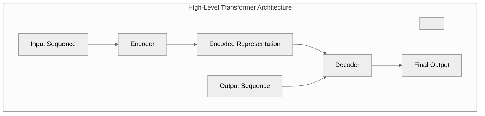
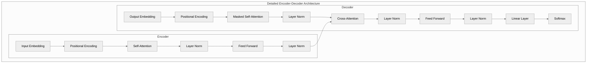
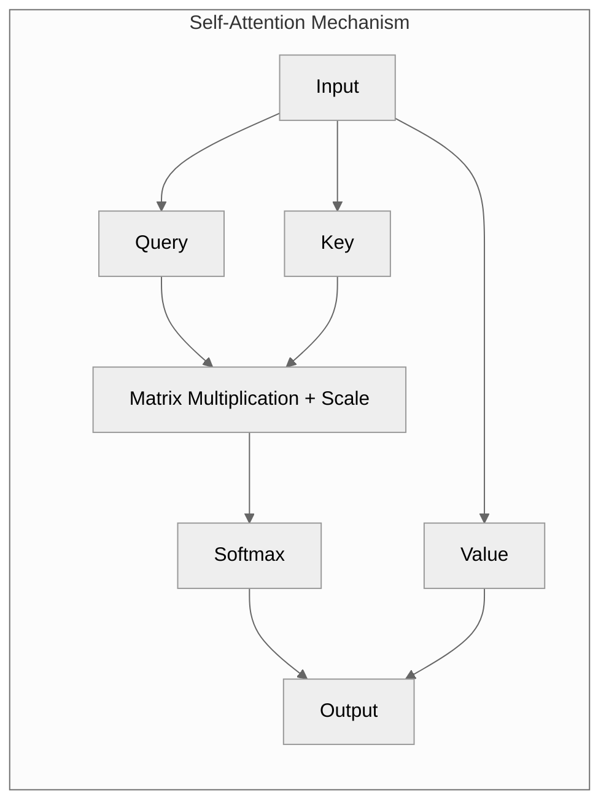

# "Attention Is All You Need"

"Attention Is All You Need" is a groundbreaking research paper published in 2017 by Ashish Vaswani et al. It introduced the Transformer model, a novel neural network architecture that has since become the foundation of many modern advancements in machine learning, particularly in natural language processing (NLP).

## Key Contributions of the Paper

1. **Transformer Architecture:**
   - The paper proposed a new architecture called the **Transformer** that relies entirely on the **attention mechanism** to handle relationships in sequential data.
   - It eliminated the need for recurrence (as in RNNs or LSTMs) and convolution (as in CNNs), enabling faster training and better scalability.

2. **Attention Mechanism:**
   - The core idea is **self-attention**, which allows the model to weigh the importance of each word in a sequence relative to others. For example, in a sentence, the word "he" might attend strongly to "John" to understand its context.
   - This mechanism captures long-range dependencies in data, making the model more effective at understanding context and relationships.

3. **Positional Encoding:**

   - Unlike RNNs, Transformers process all tokens in a sequence simultaneously. To retain the order of the tokens, the authors introduced positional encodings, which provide information about each token's position in the sequence.
   - These encodings use sine and cosine functions of varying frequencies, enabling the model to learn both:
     - Absolute Positions (e.g., the position of a word in the sequence)
     - Relative Positions (e.g., the distance between two words)

4. **Scalability:**
   - By processing all tokens in parallel (thanks to self-attention), the Transformer model significantly reduced training time compared to earlier architectures like LSTMs and GRUs.

[Rest of your original content...]

## Impact and Legacy

Since its publication, "Attention Is All You Need" has revolutionized NLP and beyond:

- Models like **BERT**, **GPT-3/4**, and **Vision Transformers (ViT)** are direct descendants of this work.
- The paper has influenced fields like computer vision, speech processing, and even protein folding (e.g., AlphaFold).

**Looking for a simpler explanation?** See the [beginner-friendly overview](./docs/simple-explanation.md).

This paper has had a transformative (pun intended) impact on AI research and continues to shape the future of deep learning.

