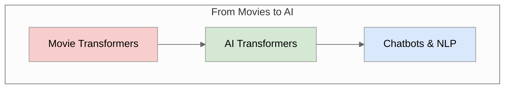
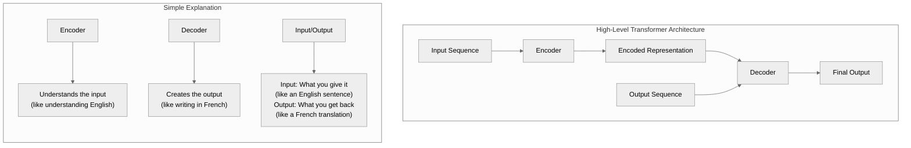
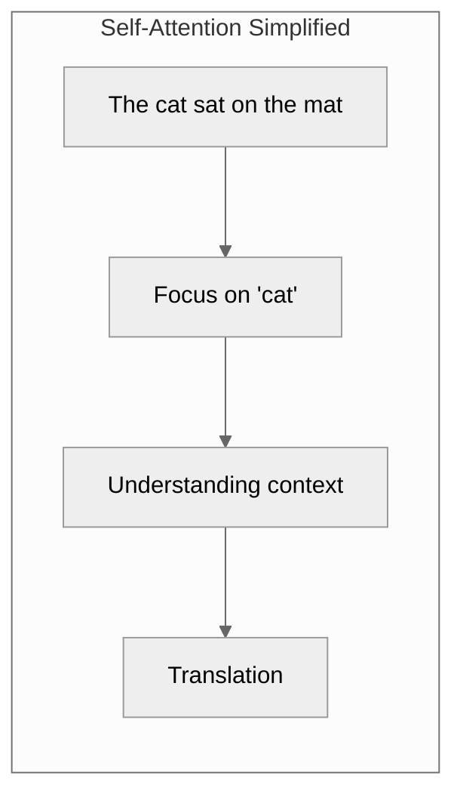
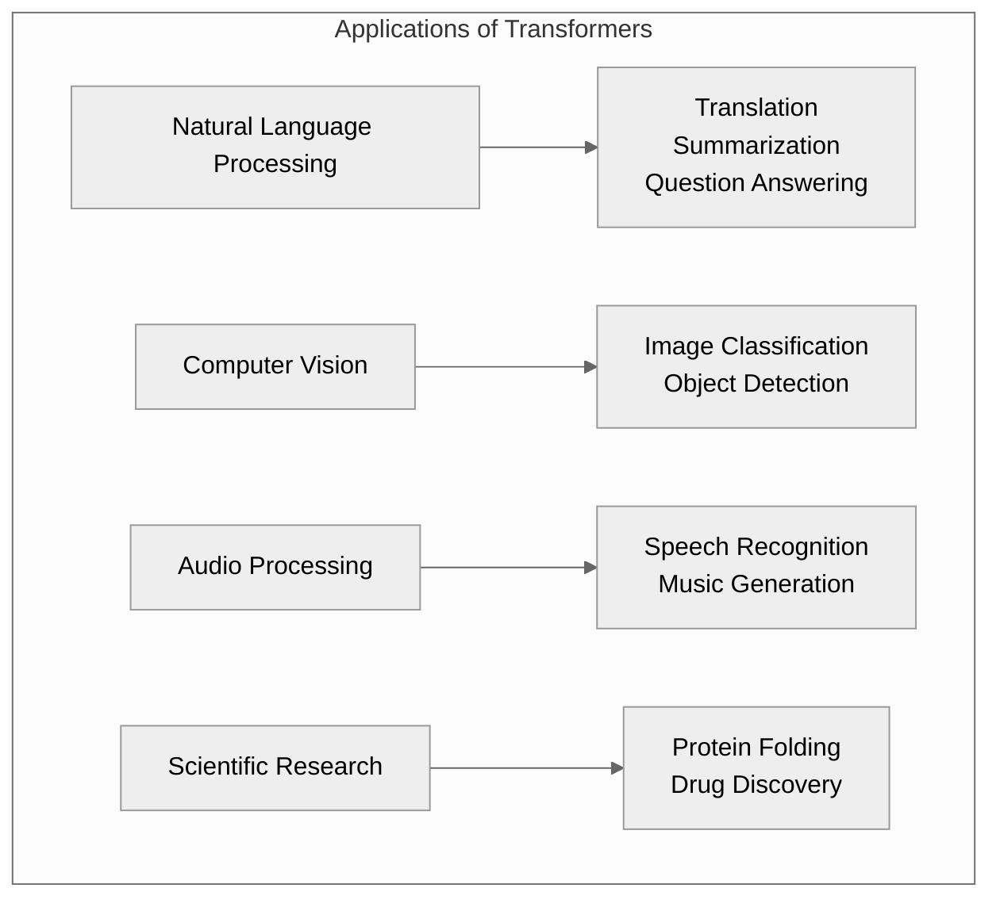

# What are Transformers, and why are so many people talking about them?

## Introduction

You might have heard a lot of talk about transformers lately. The word Transformers used to mean towering robots from movies who morphed into cars like metal gymnasts. Today, Transformers are used in Natural Language Processing. NLP is a part of many chatbots and AI integrations. You might hear about them more because they are increasingly becoming a part of everyday language when it comes to AI, as they play a crucial role in modern applications.

## What Are Transformers?

Transformers are deep learning models that rely on a mechanism called **self-attention** (or scaled dot-product attention). They do not process data sequentially like RNNs (Recurrent Neural Networks) but instead analyze the entire input sequence simultaneously. This enables them to capture long-range dependencies and relationships more effectively.

## Key Components of Transformers:

1. **Encoder-Decoder Structure:**

   - **Encoder:** Processes the input data and generates a representation of it.
   - **Decoder:** Takes the encoded representation and generates the output (e.g., a translation in machine translation tasks).

2. **Self-Attention Mechanism:**
   - Allows the model to focus on relevant parts of the input sequence when making predictions. For example, in translating "The cat sat on the mat," the model can "attend" to the word "cat" while predicting the corresponding translation.

3. **Positional Encoding:**

   - Since Transformers don't process data sequentially, they need a way to understand the order of tokens in a sequence. Positional encodings are added to the input embeddings to provide this information.

4. **Feedforward Layers:**
   - Fully connected layers applied after the attention mechanism to transform the input further.

## Why Are Transformers Popular?

1. **Scalability:**
   - Transformers leverage parallel processing, making them significantly faster and more scalable than RNNs or LSTMs, which process data step-by-step.
2. **Versatility:**
   - Transformers are not just for NLP anymore. They've been adapted for computer vision (e.g., Vision Transformers), audio, reinforcement learning, and even protein folding.
3. **State-of-the-Art Performance:**
   - Models like BERT, GPT, and Google's Gemini are based on Transformers and have achieved state-of-the-art results across various NLP benchmarks.
4. **Foundation Models:**
   - Large pre-trained Transformer models (e.g., GPT-4, PaLM, Gemini) can be fine-tuned for specific tasks, drastically reducing the need for task-specific labeled data.
5. **Community and Ecosystem:**
   - Tools like **Hugging Face Transformers** make it easy for developers to use and fine-tune pre-trained Transformer models.

## Applications of Transformers:

1. **Natural Language Processing (NLP):**
   - Machine translation, text summarization, sentiment analysis, question answering, etc.
2. **Computer Vision:**
   - Vision Transformers (ViTs) are used for image classification and segmentation.
3. **Speech Processing:**
   - Speech-to-text systems like Whisper use Transformer-based architectures.
4. **Scientific Research:**
   - Applications in bioinformatics (e.g., protein folding with AlphaFold).

## Why Are People Talking About Them?

- **Emerging Technologies:** Transformers are at the core of generative AI models, like ChatGPT, Bard, and DALL-E.
- **Advancements in AI:** New versions of Transformer-based models keep pushing boundaries in AI capabilities.
- **Business and Innovation:** Many industries are leveraging Transformer models for applications like chatbots, recommendation systems, and automated content creation.
